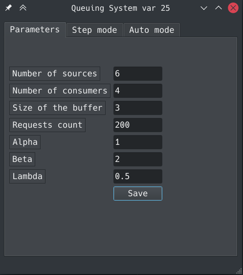
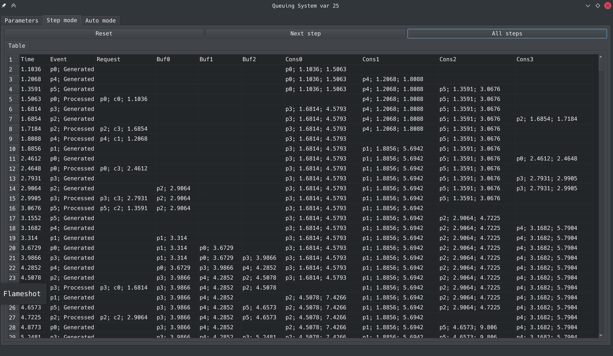
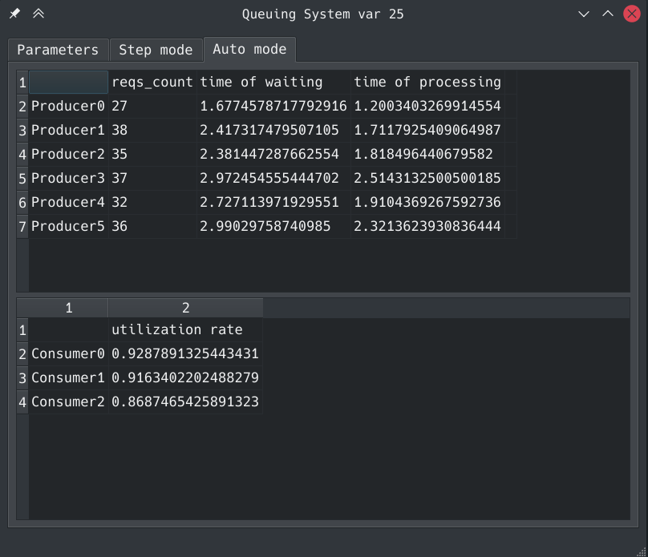

# QueuingSystem
Программа на python для эмулирования СМО.

Emulation modeling — модель системы на основе аппаратного аналога, имитирующая поведение во времени при поступлении сигналов окружения, обеспечивающая наблюдение за изменением состояний. Разработка производилась с использованием языка программирования python в среде PyCharm с использованием графической библиотеки PyQt5. 

## Параметрами моделируемой ВС являются:
1. источники (количество и тип);
2. закон генерации заявок источниками (детерминированный или случайный);
3. приборы (количество);
4. закон обслуживания заявок приборами (детерминированный или случайный);
5. емкость и тип буферной памяти (БП);

### Источники имеют равномерный закон распределения; delta = random.uniform(self.bottom, self.top)
### Приборы имеют экспоненциальный закон распределения; delta = random.expovariate(self.__lambd)
## Дисциплины буферизации: на свободное место;
## Дисциплины отказа: самая старая в буфере;
## Дисциплины постановки на обслуживание: приоритет по номеру прибора;
## Дисциплины выбора заявок на обслуживание. — приоритет по номеру прибора; — LIFO (последним пришел — первым обслужен).

Приложение содержит следующие модули: 
1. Request–содержит описание заявки. Реализует методы для получения этих описаний; 
2. Producer–реализует методы создания заявки и генерации времени заявки; 
3. Buffer–реализует методы проверки свободного места в буфере, добавления заявки в буфер, выбора заявки из буфера; 
4. Consumer–реализует методы проверки свободных приборов, загрузки заявки на прибор, удаления заявки из прибора; 
5. FunModule–реализует основной цикл работы системы; 
6. Main–реализует UI.
